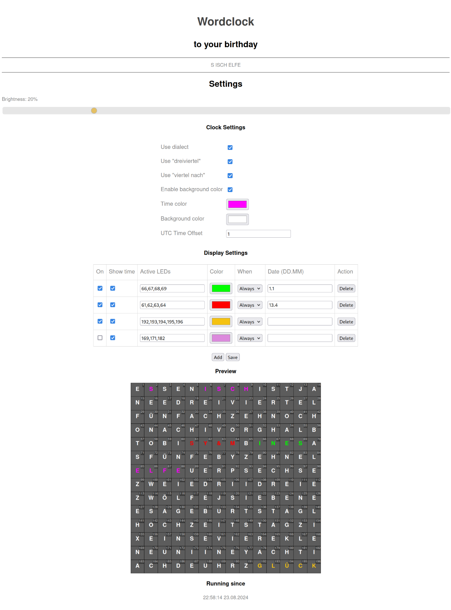

# Wordclock
A digital clock with words on it!

# Hardware setup

The project is configured to use the following hardware

* Wemos D1 Mini board with an ESP8266 microcontroller
* Led matrix with 196 WS2812B leds
* 1000uF Capacitor
* DS3231 RTC

The led matrix is built by chaining together 14 led strips containint 14 leds each which results in a 14x14 led matrix with 196 leds.

Currently the ledstrips need to be wired in a snake style:
```
x <- x <- x <- x
               ^
               |
x -> x -> x -> x
```
The arrows show the direction of the dataline. In the example the first led is the lower left one.
The first (lower) led strip starts from left to right, the next (upper) strip starts from right to left.

You can modify the following settings in `hw_settings.h`

* Number of pixels per row with the define `COL_PIXELS`
* Number of rows of pixels with the define `ROW_PIXELS`
* Position of the first led with the variable `firstLedPosition`
* Pin for the dataline for the leds with the define `PIN`

# Software

The project is developed using [PlatformIO](https://platformio.org/).
You can either use the IDE (VSCode Plugin) or the cli to build and upload the project to your microcontroller.

## Setup

If you use the commandline you need to install platformio for your system.
On archlinux this is
```
# pacman -S platformio-core
```

For vscode you need to install the extension as described [here](https://docs.platformio.org/en/latest/integration/ide/vscode.html#installation)

## Pre build step

Before every build a pre build step is running to download the current configuration of the wordclock.
This only works if your wordclock already has a wifi connection and is in the same network as your pc.

The buildstep is located in `tools/get_settings.py`.
It uses `wget` to download the configuration. This ensures that you don't loose your configuration when uploading a new filesystem.

## Building

When using the VSCode Plugin you can build/upload the binary or the filesystem by clicking on the corresponding menu items of the plugins menu.
For a reference see [here](https://docs.platformio.org/en/latest/integration/ide/vscode.html#).

For the cli you can use
```
pio run
pio run -t upload
```
to build and upload the binary.

To build and upload the filesystem containing the webpage use
```
pio run -t buildfs
pio run -t uploadfs
```

# Configuration

After uploading the binary and the filesystem the first time the microcontroller spawns a wifi accesspoint with the SSID `Wordclock`.
When you connect to it and visit [http://192.168.4.1](http://192.168.4.1) you can enter your wifi credentials.

You need a wifi connection at least once to obtain the current time with ntp.
This also initializes the RTC so a permanent wifi connection is not mandatory but still recommended so you can always configure your clock.

When visiting the ip address you see a configuration page looking like this:

<p align="center">
  
</p>

The current layout is only for german style times.
You can switch between different styles depending on different regions in germany and also enable
a dialect as spoken in the black forest where I come from.
Of course the words need to be on the front plate.

You can also enable some custom leds to be active with a custom color either at a specific date (e.g. at birthdays) or all the time.


# Modification

The letters displayed on the configuration page and the big and small title can be configured using the file `data/letter_table.js`.
It needs the following content:

```js
/*
Matrix with the letters on your frontplate starting on the top left
Each row is represented by a list and each letter is a single element in each row.
*/
var letters = {
  "clock": [
    ["E", "S"],
    ["N", "E"],
  ]
};

var title1 = "Wordclock"
var title2 = "to your birthday"
```

The letters used to display the time are configured in the file `data/words.json` it needs the following structure

```js
{
  "words": [
  ]
}
```
The words list contains an object for each word and needs the following structure
```js
{
  "ES": { /* Unique key, do not change */
    "de-DE": {
      "startPixel": 0, /* First pixel */
      "length": 2, /* Word length */
      "name": "ES" /* Word text used to display on the configuration page */
    },
    "de-Dialect": { /* Optional: Alternative word for dialect */
      "startPixel": 1,
      "length": 1,
      "name": "S"
    }
  }
}
```
Currently only vertical words are supported.
The following keys are needed:

* NULL (Can be a word of zero length)
* ES
* IST
* UHR
* EIN
* EINS
* ZWEI
* DREI
* VIER
* FÜNF
* SECHS
* SIEBEN
* ACHT
* NEUN
* ZEHN
* ELF
* ZWÖLF
* REL_VOR
* REL_NACH
* REL_VIERTEL
* REL_DREIVIERTEL
* REL_HALB
* REL_FÜNF
* REL_ZEHN
* UNBEKANNT

# Todos

 * Release building instructions
   * How to create the frontplate
   * How to build the wooden frame
 * Draw circuit diagram
 * Release CAD files
 * Cleanup the sourcecode
